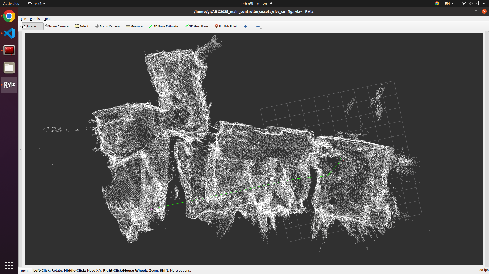

# ABC2025_main_controller



ROS2 nodes for Active Balloon Contol project 2025

## Installing with ROS

### Install ZED2 ROS2 Wrapper

Follow instructions in this [repo](https://github.com/stereolabs/zed-ros2-wrapper)

### Install this repo

```
git clone {this repository URL}
cd ~/ABC2025_main_controller
colcon build
```

## Running

Connect ZED2i with cable

### Terminal 1 : ZED Node

```
cd {your ZED repo}
rosfoxy # alias
ros2 launch zed_wrapper zed_camera.launch.py camera_model:=zed2i
```

### Terminal 2 : Path Planning Node

```
cd ~/ABC2025_main_controller
rosfoxy # alias
ros2 run path_generation dstar_bezier_path_planner
```

### Terminal 3 : Publish Goal Point

```
cd ~/ABC2025_main_controller/src/path_generation/test/
python3 yolo_publisher.py -15.5 -1.0 -3.0 # Set Goal Location
```

---

### (Optional) Terminal 4 : Visulization

```
rviz2 -d ~/ABC2025_main_controller/assets/rivz_config.rviz
```

### (Optional) Terminal 2, 5 : Use .PCD file instead of Using ZED PCD2 topic

```
# Terminal 2
cd ~/ABC2025_main_controller
rosfoxy # alias
ros2 run path_generation publish_pcd
```

```
# Terminal 5
cd ~/ABC2025_main_controller
rosfoxy # alias
ros2 run path_generation dstar_bezier_path_planner custom
```